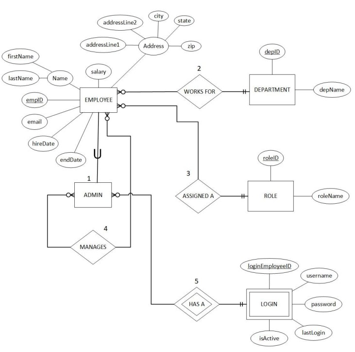
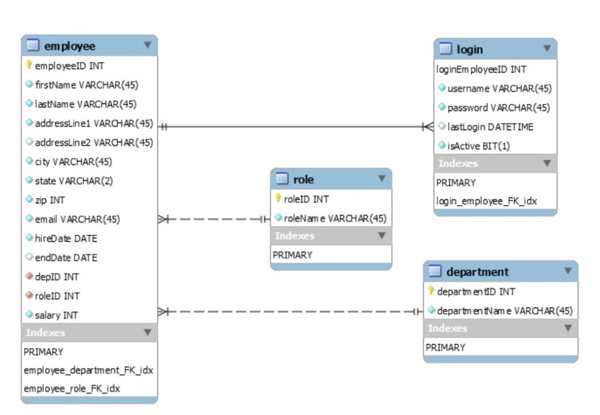

# Employee-Management-System

# View program demo [here](https://youtu.be/shu0n6grI5o)

**Description**
 A C# windows console application that connects to a local mySQL database. Used to simulate an employee management system where HR can create and manage employee profiles,
as well as pull several reports.

**Application Requirements**
- Employees that are not in the HR department cannot login to the system.
- HR employees can enter information for new employees
- HR employees can update existing employee information.
- HR employees can delete employee records.
- HR employees cannot update their own profile
- If a HR employee leaves the company (i.e. their last date of employment is entered), their account is de-activated and they will no longer have access to login to the system.
- HR employees can pull two reports through the application:
   - A report of all employees in a specified department
   - A report of all employees in a specified role

**Application ER Diagram**

**Database Requirements**
 The database will store the following information for all employees:
 - A unique employee ID
- First and last name
- Address
- Unique email address
- Salary
- date of hire
- last date of employment (if applicable)
- The department of the employee
- The role of the employee

 The database will additionally store the following information for HR employees only, to be used for logging into the system.
- Username
- Password
- Last login date and time
- Status of the login account (active/inactive)

 The database will store the following information for each department:
- A unique department ID
- The department name

 The database will store the following information for each role:
- A unique role ID
- The role name

**Additional Requirements**
- HR employees must have an employee account for a login to be created.
- An employee is assigned to one department and one role
- Many employees can be assigned to the same role.
- The same role can exist across multiple departments

**Database ER Diagram**

# View program demo [here](https://youtu.be/shu0n6grI5o)
